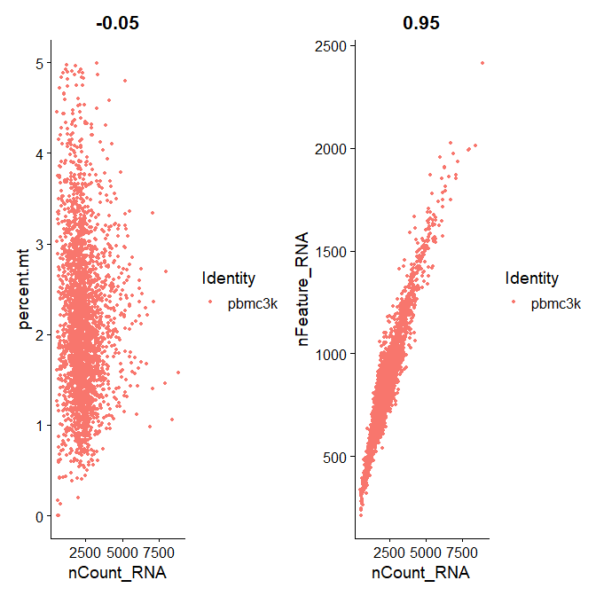

Analyze scRNAseq using Seurat
================
Zhenguo Zhang
Mar 13, 2023

-   [Install Seurat](#install-seurat)
-   [Download data](#download-data)
-   [Create Seurat object](#create-seurat-object)
-   [QC and filtering](#qc-and-filtering)
-   [Normalization](#normalization)
-   [Identify highly variable genes](#identify-highly-variable-genes)
-   [PCA](#pca)
    -   [Loadings plot](#loadings-plot)
    -   [PCA component plot](#pca-component-plot)
    -   [Heatmap](#heatmap)
-   [Troubleshooting](#troubleshooting)

This demo is adapted from the tutorial at
<https://satijalab.org/seurat/articles/pbmc3k_tutorial.html>.

## Install Seurat

## Download data

The scRNAseq data are from Peripheral Blood Mononuclear Cells (PBMC)
freely available from 10X Genomics, which contain 2,700 single cells
that were sequenced on the Illumina NextSeq 500. The raw data can be
downloaded from
[here](https://cf.10xgenomics.com/samples/cell/pbmc3k/pbmc3k_filtered_gene_bc_matrices.tar.gz)

Now let’s download and uncompress the data

``` r
dataFile<-"pbmc3k_filtered_gene_bc_matrices.tar.gz"
download.file("https://cf.10xgenomics.com/samples/cell/pbmc3k/pbmc3k_filtered_gene_bc_matrices.tar.gz", destfile = dataFile)
untar(dataFile)
fs::dir_tree("filtered_gene_bc_matrices")
```

    ## filtered_gene_bc_matrices
    ## └── hg19
    ##     ├── barcodes.tsv
    ##     ├── genes.tsv
    ##     └── matrix.mtx

## Create Seurat object

Seurat object contains both data and analysis results for a single-cell
dataset. More discussion on the data structure can be found at [Github
Wiki](https://github.com/satijalab/seurat/wiki).

``` r
library(dplyr)
library(Seurat)
library(patchwork)

pbmc.data <- Read10X(data.dir = "./filtered_gene_bc_matrices/hg19/")
pbmc <- CreateSeuratObject(counts = pbmc.data, project = "pbmc3k", min.cells = 3, min.features = 200)
pbmc
```

    ## An object of class Seurat 
    ## 13714 features across 2700 samples within 1 assay 
    ## Active assay: RNA (13714 features, 0 variable features)

## QC and filtering

This step filters some cells which may have abnormal data, using the
following common criteria:

-   The number of unique genes in a cell: low quality or empty droplets
    have few genes while doublets and multiplets will have too many
    genes. These cells need be removed. This piece of information is
    stored in `meta.data` slot of a *Seurat* object.

-   The number of molecules detected in a cell, too few and too many are
    not great.

-   The percentage of reads mapped to mitochondrial genome: low-quality
    or dying cells have extensive mitochondrial contamination.

``` r
# first calculate the RNA counts mapped to mitochondrial genes
# which start with 'MT-'
pbmc[["percent.mt"]] <- PercentageFeatureSet(pbmc, pattern = "^MT-")
# Then let's plot the QC metrics
VlnPlot(pbmc, features = c("nFeature_RNA", "nCount_RNA", "percent.mt"), ncol = 3, cols="blue")
```


We will filter the following cells out:

-   unique gene counts over 2500 or under 200
-   mitochondrial counts \> 5%

``` r
pbmc <- subset(pbmc, subset = nFeature_RNA > 200 & nFeature_RNA < 2500 & percent.mt < 5)
# plots again
VlnPlot(pbmc, features = c("nFeature_RNA", "nCount_RNA", "percent.mt"), ncol = 3, cols="blue")
```


``` r
# also the feature relationship
plot1 <- FeatureScatter(pbmc, feature1 = "nCount_RNA", feature2 = "percent.mt")
plot2 <- FeatureScatter(pbmc, feature1 = "nCount_RNA", feature2 = "nFeature_RNA")
plot1 + plot2 # combine the plots with patchwork
```



## Normalization

After removing bad cells from data, the next step is to normalize the
data to make the cells comparable in RNA expression. The function used
here is
[Seurat::NormalizeData](https://satijalab.org/seurat/reference/normalizedata).

``` r
pbmc <- NormalizeData(pbmc, normalization.method = "LogNormalize", scale.factor = 10000)
# check the data, gene x cells
head(pbmc[["RNA"]]@data[,1:10])
```

    ## 6 x 10 sparse Matrix of class "dgCMatrix"
    ##                                  
    ## AL627309.1    . . . . . . . . . .
    ## AP006222.2    . . . . . . . . . .
    ## RP11-206L10.2 . . . . . . . . . .
    ## RP11-206L10.9 . . . . . . . . . .
    ## LINC00115     . . . . . . . . . .
    ## NOC2L         . . . . . . . . . .

## Identify highly variable genes

This step will identify most variable genes, i.e., high expression in
some cells but low expression in others, and these genes will be useful
for highlighting biological signals and used in downstream analyses such
as PCA.

``` r
# get the most variable 2000 genes
pbmc <- FindVariableFeatures(pbmc, selection.method = "vst", nfeatures = 2000)

# Identify the 10 most highly variable genes
top10 <- head(VariableFeatures(pbmc), 10)

# plot the top 10 genes with labels
plot1 <- VariableFeaturePlot(pbmc)
plot2 <- LabelPoints(plot = plot1, points = top10, repel = TRUE)
plot2
```


\## Scaling data

In this step, the RNA counts for each gene is scaled so that the mean
value and variance across cells are 0 and 1, respectively. Through this
step, all the genes have equal weight in downstream analyses, preventing
the dominance by highly-expressed genes.

By default, the function `ScaleData()` will only scale the most variable
genes as selected above. If one wants to scale more features, please use
the parameter *features* to specify which genes are to be scaled.

``` r
all.genes <- rownames(pbmc)
pbmc <- ScaleData(pbmc, features = all.genes)
#pbmc <- ScaleData(pbmc)
# let's have a look at the data
head(pbmc[["RNA"]]@scale.data[,1:10])
```

    ##               AAACATACAACCAC-1 AAACATTGAGCTAC-1 AAACATTGATCAGC-1
    ## AL627309.1         -0.05812316      -0.05812316      -0.05812316
    ## AP006222.2         -0.03357571      -0.03357571      -0.03357571
    ## RP11-206L10.2      -0.04166819      -0.04166819      -0.04166819
    ## RP11-206L10.9      -0.03364562      -0.03364562      -0.03364562
    ## LINC00115          -0.08223981      -0.08223981      -0.08223981
    ## NOC2L              -0.31717081      -0.31717081      -0.31717081
    ##               AAACCGTGCTTCCG-1 AAACCGTGTATGCG-1 AAACGCACTGGTAC-1
    ## AL627309.1         -0.05812316      -0.05812316      -0.05812316
    ## AP006222.2         -0.03357571      -0.03357571      -0.03357571
    ## RP11-206L10.2      -0.04166819      -0.04166819      -0.04166819
    ## RP11-206L10.9      -0.03364562      -0.03364562      -0.03364562
    ## LINC00115          -0.08223981      -0.08223981      -0.08223981
    ## NOC2L              -0.31717081      -0.31717081      -0.31717081
    ##               AAACGCTGACCAGT-1 AAACGCTGGTTCTT-1 AAACGCTGTAGCCA-1
    ## AL627309.1         -0.05812316      -0.05812316      -0.05812316
    ## AP006222.2         -0.03357571      -0.03357571      -0.03357571
    ## RP11-206L10.2      -0.04166819      -0.04166819      -0.04166819
    ## RP11-206L10.9      -0.03364562      -0.03364562      -0.03364562
    ## LINC00115          -0.08223981      -0.08223981      -0.08223981
    ## NOC2L              -0.31717081      -0.31717081      -0.31717081
    ##               AAACGCTGTTTCTG-1
    ## AL627309.1         -0.05812316
    ## AP006222.2         -0.03357571
    ## RP11-206L10.2      -0.04166819
    ## RP11-206L10.9      -0.03364562
    ## LINC00115          -0.08223981
    ## NOC2L              -0.31717081

## PCA

In this step we will reduce the data dimensions by applying PCA. This
step is time-consuming, so be patient.

``` r
pbmc <- RunPCA(pbmc, features = VariableFeatures(object = pbmc))
# let's have a look at the result
print(pbmc[["pca"]], dims = 1:5, nfeatures = 5)
```

    ## PC_ 1 
    ## Positive:  CST3, TYROBP, LST1, AIF1, FTL 
    ## Negative:  MALAT1, LTB, IL32, IL7R, CD2 
    ## PC_ 2 
    ## Positive:  CD79A, MS4A1, TCL1A, HLA-DQA1, HLA-DQB1 
    ## Negative:  NKG7, PRF1, CST7, GZMB, GZMA 
    ## PC_ 3 
    ## Positive:  HLA-DQA1, CD79A, CD79B, HLA-DQB1, HLA-DPB1 
    ## Negative:  PPBP, PF4, SDPR, SPARC, GNG11 
    ## PC_ 4 
    ## Positive:  HLA-DQA1, CD79B, CD79A, MS4A1, HLA-DQB1 
    ## Negative:  VIM, IL7R, S100A6, IL32, S100A8 
    ## PC_ 5 
    ## Positive:  GZMB, NKG7, S100A8, FGFBP2, GNLY 
    ## Negative:  LTB, IL7R, CKB, VIM, MS4A7

Now let’s visualize the results.

### Loadings plot

``` r
VizDimLoadings(pbmc, dims = 1:4, reduction = "pca", ncol=2)
```


### PCA component plot

``` r
DimPlot(pbmc, dims=c(1,2), reduction = "pca")
```


### Heatmap

Each heatmap shows the PCA scores.

``` r
DimHeatmap(pbmc, dims = 1:6, cells = 500, balanced = TRUE, ncol=2)
```


## Troubleshooting

-   “Error in validityMethod(as(object, superClass)) : object
    ‘CsparseMatrix_validate’ not found”
    -   Uninstall and reinstall the package ‘Matrix’.
